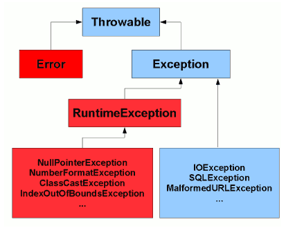

# Checked & Unchecked exception
`Checked` exception is checked for at compile time
It could throw FileNotFound Exception. we need to deal with this possibility.
FileNotFound is checked exception.
```java
public class CheckedVsUncheckedMain {

    public static void main(String[] args) {
        readFile("myFile.txt");
    }

    private static void readFile (String fileName){
        FileReader reader = new FileReader(fileName); // error!

    }

}
```
## How to Java determine Checked & Unchecked exception
RuntimeException of subclasses are `Unchecked exception`



`Unchecked exception` is a programming error and is fatal.
`Checked exception` is an exception condition within your code's logic and can be recovered or re-tried from.


# Custom Exception
You can create customized exception class.

Customized exception class must extend Exception's subclass. (Don't extend `Throwable` or `Error`!!)
you just can extend Exception class, but it is better to specify subclass for more clarity.

Customized exception can be caused by some other exception. (It means that you can give information which exception is root)
```java
public class AgeLessThanZeroException extends IllegalArgumentException{

    public AgeLessThanZeroException() {
    }

    public AgeLessThanZeroException(String message) {
        super(message);
    }

    public AgeLessThanZeroException(Throwable cause){
        super(cause);
    }

    public AgeLessThanZeroException(String message, Throwable cause){
        super(message,cause);
    }
}
```
```java
public class CustomExceptionMain {

    public static void main(String[] args) {
        validateAge(-1);
    }

    private static void validateAge(int age) {
        if(age < 0 ){
            throw new AgeLessThanZeroException("Oh no!",new RuntimeException());
        }
    }

}
```
